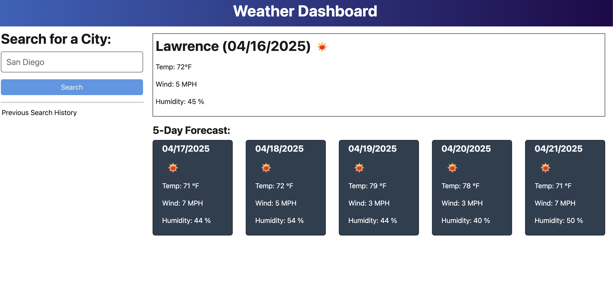
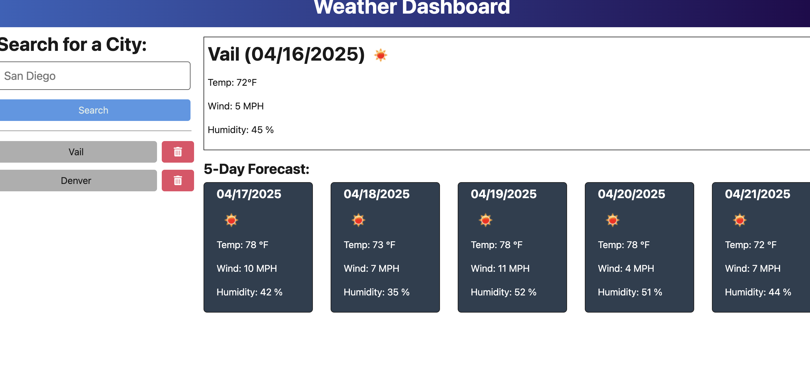
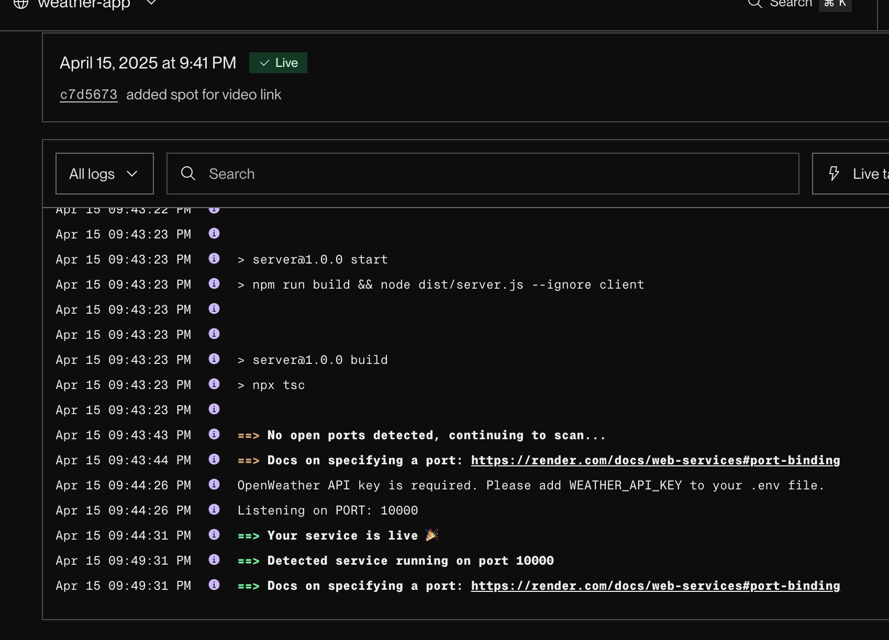

# Weather Dashboard

A weather dashboard application that allows users to search for cities and view their current weather conditions and a 5-day forecast.

## Features

- Search for a city to view its current weather and 5-day forecast
- View your search history
- Click on a city in your search history to view its weather data again
- Delete cities from your search history
- Responsive design that works on multiple screen sizes

## Technologies Used

- Frontend:
  - HTML
  - CSS
  - JavaScript/TypeScript
  - Vite

- Backend:
  - Node.js
  - Express
  - TypeScript
  - OpenWeather API

## Installation

1. Clone the repository
2. Create a `.env` file in the root directory with your OpenWeather API key:
   ```
   WEATHER_API_KEY=your_api_key_here
   ```
3. Install dependencies:
   ```
   npm install
   ```
4. Start the development server:
   ```
   npm run start:dev
   ```

## Usage

1. Enter a city name in the search box and click the search button
2. View the current weather conditions and 5-day forecast
3. The city will be added to your search history
4. Click on a city in your search history to view its weather data again
5. Click the trash icon next to a city in your search history to remove it

## Deployment

This application can be deployed to Render by following these steps:

1. Create a new Web Service on Render
2. Connect your GitHub repository
3. Add the following environment variables:
   - `WEATHER_API_KEY`: Your OpenWeather API key
4. Set the build command to: `npm install && npm run build`
5. Set the start command to: `npm start`

## Screenshots and Live Demo

### Live Demo
Check out the live application here: [Weather App](https://weather-app-blxz.onrender.com/)

### Screenshots
#### Current Weather View


#### 5-Day Forecast


#### Responsive Design


## Credits


This project was created with assistance from:
- Online Learning Assistant
- Claude AI
- My friend Joe

## License

This project is licensed under the ISC License - see the LICENSE file for details.
